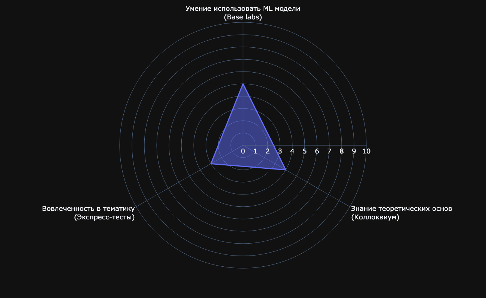

# Курс по машинному обучению для 3 курса факультета ВМК МГУ, 2025/2026

В репозитории находятся материалы по лекциям машинного обучения 2025/2026

<!-- TOC -->

- [Курс по машинному обучению для 3 курса факультета ВМК МГУ, 2025/2026](#%D0%9A%D1%83%D1%80%D1%81-%D0%BF%D0%BE-%D0%BC%D0%B0%D1%88%D0%B8%D0%BD%D0%BD%D0%BE%D0%BC%D1%83-%D0%BE%D0%B1%D1%83%D1%87%D0%B5%D0%BD%D0%B8%D1%8E-%D0%B4%D0%BB%D1%8F-3-%D0%BA%D1%83%D1%80%D1%81%D0%B0-%D1%84%D0%B0%D0%BA%D1%83%D0%BB%D1%8C%D1%82%D0%B5%D1%82%D0%B0-%D0%92%D0%9C%D0%9A-%D0%9C%D0%93%D0%A3-20252026)
    - [Система оценивания](#%D0%A1%D0%B8%D1%81%D1%82%D0%B5%D0%BC%D0%B0-%D0%BE%D1%86%D0%B5%D0%BD%D0%B8%D0%B2%D0%B0%D0%BD%D0%B8%D1%8F)
    - [Подготовка к выполнению практических заданий](#%D0%9F%D0%BE%D0%B4%D0%B3%D0%BE%D1%82%D0%BE%D0%B2%D0%BA%D0%B0-%D0%BA-%D0%B2%D1%8B%D0%BF%D0%BE%D0%BB%D0%BD%D0%B5%D0%BD%D0%B8%D1%8E-%D0%BF%D1%80%D0%B0%D0%BA%D1%82%D0%B8%D1%87%D0%B5%D1%81%D0%BA%D0%B8%D1%85-%D0%B7%D0%B0%D0%B4%D0%B0%D0%BD%D0%B8%D0%B9)
    - [Практические задания](#%D0%9F%D1%80%D0%B0%D0%BA%D1%82%D0%B8%D1%87%D0%B5%D1%81%D0%BA%D0%B8%D0%B5-%D0%B7%D0%B0%D0%B4%D0%B0%D0%BD%D0%B8%D1%8F)
        - [Условные обозначения](#%D0%A3%D1%81%D0%BB%D0%BE%D0%B2%D0%BD%D1%8B%D0%B5-%D0%BE%D0%B1%D0%BE%D0%B7%D0%BD%D0%B0%D1%87%D0%B5%D0%BD%D0%B8%D1%8F)
    - [Материалы](#%D0%9C%D0%B0%D1%82%D0%B5%D1%80%D0%B8%D0%B0%D0%BB%D1%8B)
    - [Материалы прошлых лет](#%D0%9C%D0%B0%D1%82%D0%B5%D1%80%D0%B8%D0%B0%D0%BB%D1%8B-%D0%BF%D1%80%D0%BE%D1%88%D0%BB%D1%8B%D1%85-%D0%BB%D0%B5%D1%82)

<!-- /TOC -->

---

## Система оценивания

[Презентация с правилами оценивания](./slides/intro/ML_grading_system.pdf)

[Поясняющее видео](https://disk.yandex.ru/i/0QSSuWMEFeo6JQ)

| Уровень владения      | Зачет (осень) | Начинающий (3, весна) | Средний (4, весна) | Продвинутый (5, весна)      |
|-----------------------|---------------|-----------------------|--------------------|-----------------------------|
| **Активность**        |               |                       |                    |                             |
| Base labs             | 5             | 5                     | 7                  | 7                           |
| Research labs         | 0             | 2                     | 4                  | 7                           |
| Коллоквиум            | 4             | 4                     | 5                  | 6                           |
| Экспресс-тесты        | 3             | 3                     | 5                  | 6                           |
| Экзамен               | -             | -                     | -                  | 5   по системе "сдать/не сдать" |

> Примечание: В таблице указаны пороги для сданных в срок заданий. В [презентации](./slides/intro/ML_grading_system.pdf) описаны SOS-случаи, позволяющие добрать баллы в конце семестра, и пороги для них. 

 
 

---

## Подготовка к выполнению практических заданий

* [Туториал по Google Colab](./tutorials/tutorial_colab.md)
* [Туториал по проверяющей системе](./tutorials/tutorial_test_system.md)
* [Туториал по установке рабочего окружения Python](./tutorials/tutorial_environment_setup.md)
* [Туториал по типам практических заданий](./tutorials/tutorial_tasks.md)

---

## Практические задания

<table>
    <thead>
        <tr>
            <th>Номер</th>
            <th>Часть</th>
            <th>Название</th>
            <th>Дата выдачи</th>
            <th>Дедлайн</th>
            <th>Типы подзаданий</th>
            <th>Ссылка</th>
        </tr>
    </thead>
    <tbody>
        <tr>
            <td>1</td>
            <td>1</td>
            <td>Основы Python</td>
            <td>14.09.2025</td>
            <td>22.09.2025</td>
            <td>Base[UT]</td>
            <td><a href="./tasks/base_task1/">Ссылка</a></td>
        </tr>
        <tr>
            <td rowspan="2">2</td>
            <td>1</td>
            <td rowspan="2">Основы Numpy + Pandas + Визуализация</td>
            <td rowspan="2">18.09.2025</td>
            <td>03.10.2025</td>
            <td>Base[UT, PR]</td>
            <td><a href="./tasks/base_task2/">Ссылка</a></td>
        </tr>
        <tr>
            <td>2</td>
            <td>03.10.2025</td>
            <td>Research[UT, PR]</td>
            <td><a href="./tasks/research_task1/">Ссылка</a></td>
        </tr>
        <tr>
            <td rowspan="2">3</td>
            <td>1</td>
            <td>Sklearn-scaling-cv</td>
            <td rowspan="2">02.10.2025</td>
            <td>10.10.2025</td>
            <td>Base[UT, PR]</td>
            <td></td>
        </tr>
        <tr>
            <td>2</td>
            <td>kNN</td>
            <td>17.10.2025</td>
            <td>Research[UT, PR]</td>
            <td></td>
        </tr>
        <tr>
            <td>4</td>
            <td>1</td>
            <td>Анализ данных и обработка признаков</td>
            <td>09.10.2025</td>
            <td>17.10.2025</td>
            <td>Base[UT, PR]</td>
            <td></td>
        </tr>
        <tr>
            <td rowspan="2">5</td>
            <td>1</td>
            <td rowspan="2">Линейные модели: регрессия</td>
            <td rowspan="2">16.10.2025</td>
            <td rowspan="2">24.10.2025</td>
            <td>Base[UT, PR]</td>
            <td></td>
        </tr>
        <tr>
            <td>2</td>
            <td>Research[UT, PR]</td>
            <td></td>
        </tr>
        <tr>
            <td rowspan="2">6</td>
            <td>1</td>
            <td rowspan="2">Линейные модели: классификация</td>
            <td rowspan="2">23.10.2025</td>
            <td>31.10.2025</td>
            <td>Base[UT, PR]</td>
            <td></td>
        </tr>
        <tr>
            <td>2</td>
            <td>07.11.2025</td>
            <td>Research[UT, PR]</td>
            <td></td>
        </tr>
        <tr>
            <td rowspan="2">7</td>
            <td>1</td>
            <td rowspan="2">SVM</td>
            <td rowspan="2">27.11.2025</td>
            <td>05.12.2025</td>
            <td>Base[UT, PR]</td>
            <td></td>
        </tr>
        <tr>
            <td>2</td>
            <td>12.12.2025</td>
            <td>Research[UT, PR]</td>
            <td></td>
        </tr>
    </tbody>
</table>

### Условные обозначения

- Base[UT] - Базовое задание с unit-тестами
- Base[UT, PR] - Базовое задание с unit-тестами и кросс-проверкой
- Research[UT, PR] - Исследовательское задание с unit-тестами и кросс-проверкой

## Материалы

* [Первый поток (В.В. Китов)](./1_stream.md)
* [Второй поток (К.В. Воронцов)](./2_stream.md)
* [Третий поток (М.И. Петровский)](./3_stream.md)

## Материалы прошлых лет

* [ML 2024-2025](https://github.com/MSU-ML-COURSE/ML-COURSE-24-25)
* [ML 2023-2024](https://github.com/MSU-ML-COURSE/ML-COURSE-23-24)
* [ML 2022-2023](https://github.com/MSU-ML-COURSE/ML-COURSE-22-23)
* [ML 2021-2022](https://github.com/MSU-ML-COURSE/ML-COURSE-21-22)
