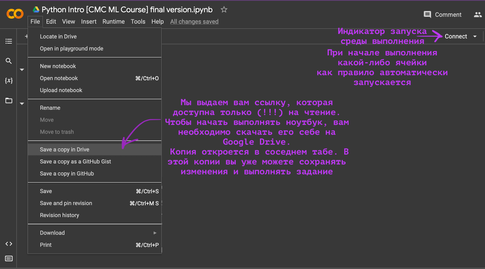
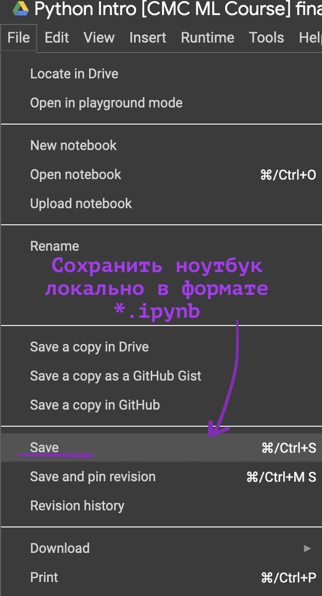
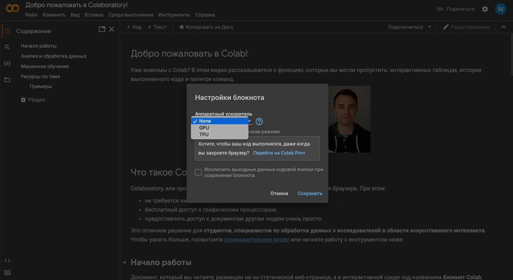
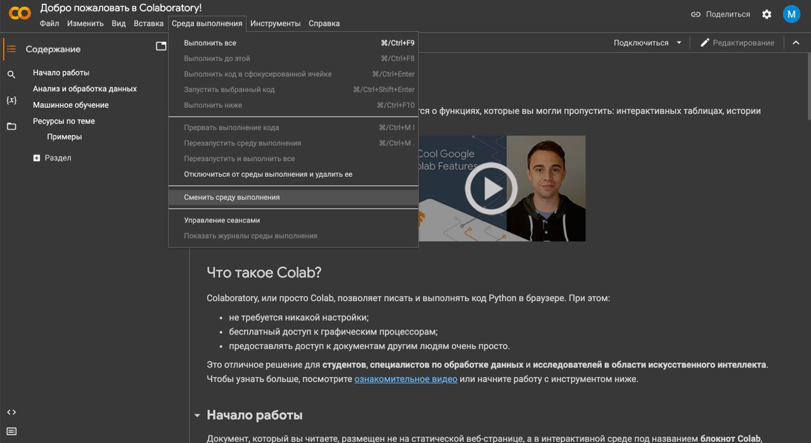

# Туториал по использованию Google Colab и подготовке рабочей среды

<!-- TOC -->

- [Туториал по использованию Google Colab и подготовке рабочей среды](#%D1%82%D1%83%D1%82%D0%BE%D1%80%D0%B8%D0%B0%D0%BB-%D0%BF%D0%BE-%D0%B8%D1%81%D0%BF%D0%BE%D0%BB%D1%8C%D0%B7%D0%BE%D0%B2%D0%B0%D0%BD%D0%B8%D1%8E-google-colab-%D0%B8-%D0%BF%D0%BE%D0%B4%D0%B3%D0%BE%D1%82%D0%BE%D0%B2%D0%BA%D0%B5-%D1%80%D0%B0%D0%B1%D0%BE%D1%87%D0%B5%D0%B9-%D1%81%D1%80%D0%B5%D0%B4%D1%8B)
    - [Начало работы: открытие и сохранение блокнота](#%D0%BD%D0%B0%D1%87%D0%B0%D0%BB%D0%BE-%D1%80%D0%B0%D0%B1%D0%BE%D1%82%D1%8B-%D0%BE%D1%82%D0%BA%D1%80%D1%8B%D1%82%D0%B8%D0%B5-%D0%B8-%D1%81%D0%BE%D1%85%D1%80%D0%B0%D0%BD%D0%B5%D0%BD%D0%B8%D0%B5-%D0%B1%D0%BB%D0%BE%D0%BA%D0%BD%D0%BE%D1%82%D0%B0)
    - [Важные ограничения и рекомендации](#%D0%B2%D0%B0%D0%B6%D0%BD%D1%8B%D0%B5-%D0%BE%D0%B3%D1%80%D0%B0%D0%BD%D0%B8%D1%87%D0%B5%D0%BD%D0%B8%D1%8F-%D0%B8-%D1%80%D0%B5%D0%BA%D0%BE%D0%BC%D0%B5%D0%BD%D0%B4%D0%B0%D1%86%D0%B8%D0%B8)
    - [Работа с GPU](#%D1%80%D0%B0%D0%B1%D0%BE%D1%82%D0%B0-%D1%81-gpu)

<!-- /TOC -->
В нашем курсе машинного обучения предполагается выполнение заданий с использованием языка Python 3 и связанных с ним инструментов. Чтобы облегчить вам выполнение практических заданий и предоставить вычислительные ресурсы (например, если у вас недостаточно мощный компьютер), мы рекомендуем использовать среду **Google Colab**.

- Сайт проекта: https://colab.research.google.com/
- Необходим аккаунт Google (ваш аккаунт `gse.cs.msu.ru` уже имеет доступ к Google Drive и Google Colab). Если доступа по каким-то причинам нет, можно зарегистрировать аккаунт Gmail (gmail.com).
- Google Colab тесно интегрирован с Google Drive. Ваш Диск будет использоваться в качестве файлового хранилища для заданий.
- Colab — это интерактивная среда для выполнения кода на Python, аналогичная Jupyter Notebook/Jupyter Lab. Если вы знакомы с ними, переход на Colab не составит труда.
- В Colab можно писать и исполнять код в ячейках, добавлять текст с форматированием, вставлять изображения и многое другое.
- [Официальное введение от Google](https://colab.research.google.com/notebooks/intro.ipynb?hl=ru-ru)

## Начало работы: открытие и сохранение блокнота

<!--  -->

Задания для кросс-проверки мы будем выдавать в виде ноутбуков (*.ipynb файлов). Вам будет выдана ссылка на ноутбук, доступная только для чтения. Чтобы начать работу, вам необходимо создать свою копию этого ноутбука на своем Google Диске. В интерфейсе Colab для этого есть кнопки Файл -> «Сохранить копию на Диске» (рекомендуется) или «Открыть в режиме песочницы» (также создает вашу копию). Все изменения вы вносите и сохраняете в своей собственной копии файла.

---

Обратите внимание: Файлы данных, необходимые для задания, обычно автоматически загружаются в среду выполнения Colab и доступны в папке /content. Если в задании указано скачать данные самостоятельно — следуйте инструкциям в ноутбуке.

---

В тестирующую систему необходимо загрузить заполненный ноутбук (*.ipynb файл). Все ячейки должны быть выполнены, все результаты выполнения данных ячеек должны быть видны.

## Важные ограничения и рекомендации

Google Colab имеет ограничения на используемые ресурсы (оперативная память, CPU) и продолжительность одной сессии.

Официальные ограничения не афишируются (FAQ), но обычно активная сессия прерывается через ~12 часов непрерывной работы или после длительного простоя.

Если для выполнения задания не требуется доступ к GPU, то крайне **не рекомендуется** переключаться на GPU-среду выполнения. GPU-сессии имеют более скромные лимиты по времени исполнения ноутбука.

Если вы запускаете длительные вычисления (более 1-2 часов):

- Не закрывайте браузер с вкладкой Colab.
- Не переводите компьютер в спящий режим.
- Периодически взаимодействуйте с блокнотом, чтобы сессия не считалась неактивной.

Для длительных вычислений рекомендуется периодически сохранять промежуточные результаты на Google Диск с помощью кода (например, `from google.colab import drive; drive.mount('/content/drive')`).

Рекомендации по использованию:

- Каждый ноутбук с заданием содержит ячейку, подгружающую библиотеки нужных версий. Не забывайте исполнять данную ячейку перед началом выполнения задания.
- В Google Colab рекомендуется выполнять только те части заданий, которые сдаются в формате *.ipynb на кросс-проверку.
- Задания с юнит-тестированием и ML-задачи предпочтительнее делать локально на своем компьютере. Это удобнее, так как мы предоставляем скрипты и тесты для локальной проверки, и эти задачи обычно не требуют больших вычислительных ресурсов.
- Если вы предпочитаете делать и ipynb-задания локально, настройте виртуальное окружение с версиями библиотек, указанными в начале курса (см [туториал по настройке окружения](./tutorial_environment_setup.md)).

## Работа с GPU

Для обучения нейронных сетей и некоторых других ресурсоемких алгоритмов (например, градиентного бустинга в `xgboost`, `catboost`, `lightgbm`) предпочтительнее использовать графические процессоры (GPU).

1. Чтобы включить GPU, необходимо изменить тип среды выполнения ("runtime"):
    - Среда выполнения -> Сменить среду выполнения -> Аппаратный ускоритель -> GPU -> Сохранить

    - 

    - 
2. Для проверки наличия GPU можно использовать команду `!nvidia-smi`, выполнив её в ячейке с кодом
3. Включение GPU в настройках недостаточно. Нужно явно указать в коде использование GPU. Способы различаются в зависимости от библиотеки:
    - Для CatBoost: `task_type='GPU'` или `task_type='CUDA'`
    - Для PyTorch: `torch.device("cuda")`

> **Важно**: При смене типа среды выполнения (например, с CPU на GPU) блокнот полностью перезапускается. Убедитесь, что сохранили все результаты работы и файлы перед сменой среды выполнения ("runtime").
