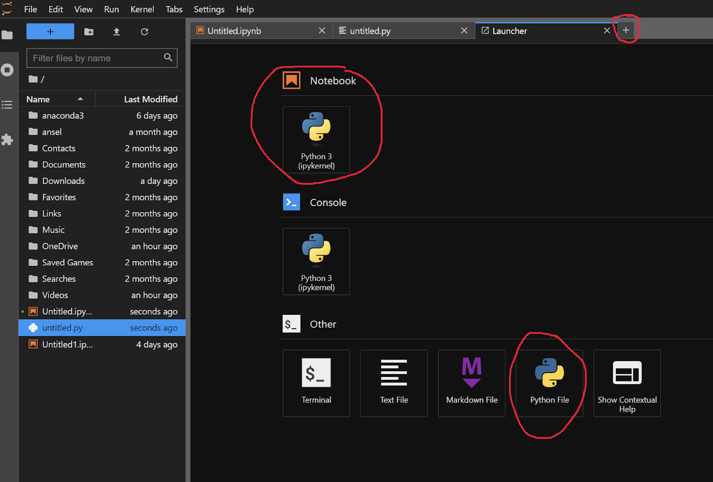

# Туториал по установке рабочего окружения в Python для решения задач

<!-- TOC -->

- [Туториал по установке рабочего окружения в Python для решения задач](#%D1%82%D1%83%D1%82%D0%BE%D1%80%D0%B8%D0%B0%D0%BB-%D0%BF%D0%BE-%D1%83%D1%81%D1%82%D0%B0%D0%BD%D0%BE%D0%B2%D0%BA%D0%B5-%D1%80%D0%B0%D0%B1%D0%BE%D1%87%D0%B5%D0%B3%D0%BE-%D0%BE%D0%BA%D1%80%D1%83%D0%B6%D0%B5%D0%BD%D0%B8%D1%8F-%D0%B2-python-%D0%B4%D0%BB%D1%8F-%D1%80%D0%B5%D1%88%D0%B5%D0%BD%D0%B8%D1%8F-%D0%B7%D0%B0%D0%B4%D0%B0%D1%87)
    - [Введение](#%D0%B2%D0%B2%D0%B5%D0%B4%D0%B5%D0%BD%D0%B8%D0%B5)
    - [Работа с Anaconda](#%D1%80%D0%B0%D0%B1%D0%BE%D1%82%D0%B0-%D1%81-anaconda)
        - [Установка Anaconda Navigator](#%D1%83%D1%81%D1%82%D0%B0%D0%BD%D0%BE%D0%B2%D0%BA%D0%B0-anaconda-navigator)
        - [Настройка виртуального окружения](#%D0%BD%D0%B0%D1%81%D1%82%D1%80%D0%BE%D0%B9%D0%BA%D0%B0-%D0%B2%D0%B8%D1%80%D1%82%D1%83%D0%B0%D0%BB%D1%8C%D0%BD%D0%BE%D0%B3%D0%BE-%D0%BE%D0%BA%D1%80%D1%83%D0%B6%D0%B5%D0%BD%D0%B8%D1%8F)
        - [Запуск Jupyter Lab и работа с файлами](#%D0%B7%D0%B0%D0%BF%D1%83%D1%81%D0%BA-jupyter-lab-%D0%B8-%D1%80%D0%B0%D0%B1%D0%BE%D1%82%D0%B0-%D1%81-%D1%84%D0%B0%D0%B9%D0%BB%D0%B0%D0%BC%D0%B8)
        - [Тестирование заданий](#%D1%82%D0%B5%D1%81%D1%82%D0%B8%D1%80%D0%BE%D0%B2%D0%B0%D0%BD%D0%B8%D0%B5-%D0%B7%D0%B0%D0%B4%D0%B0%D0%BD%D0%B8%D0%B9)
    - [Альтернативы Anaconda](#%D0%B0%D0%BB%D1%8C%D1%82%D0%B5%D1%80%D0%BD%D0%B0%D1%82%D0%B8%D0%B2%D1%8B-anaconda)
        - [Настройка окружения через pip](#%D0%BD%D0%B0%D1%81%D1%82%D1%80%D0%BE%D0%B9%D0%BA%D0%B0-%D0%BE%D0%BA%D1%80%D1%83%D0%B6%D0%B5%D0%BD%D0%B8%D1%8F-%D1%87%D0%B5%D1%80%D0%B5%D0%B7-pip)
        - [Настройка окружения через pipenv](#%D0%BD%D0%B0%D1%81%D1%82%D1%80%D0%BE%D0%B9%D0%BA%D0%B0-%D0%BE%D0%BA%D1%80%D1%83%D0%B6%D0%B5%D0%BD%D0%B8%D1%8F-%D1%87%D0%B5%D1%80%D0%B5%D0%B7-pipenv)
    - [Список файлов настройки](#%D1%81%D0%BF%D0%B8%D1%81%D0%BE%D0%BA-%D1%84%D0%B0%D0%B9%D0%BB%D0%BE%D0%B2-%D0%BD%D0%B0%D1%81%D1%82%D1%80%D0%BE%D0%B9%D0%BA%D0%B8)

<!-- /TOC -->

## Введение

В нашем курсе есть несколько различных типов заданий, каждое из которых предполагает выполнение с помощью различных инструментов.

- **Задания с кросс-проверкой (peer-review)** мы предлагаем выполнять в Google Colab (настройку предлагаем непосредственно в задании), но вы можете предпочесть их выполнение на локальном компьютере
- **Задания с юнит-тестированием (Unit-tests) и ML-задачи (ML)** рекомендуется делать на локальном компьютере — так их будет проще решать и отлаживать

Для упрощения сдачи заданий и чтобы избежать ошибок, связанных с несовместимостью версий библиотек вам потребуется настроить рабочее окружение, которое будет использоваться на протяжении всего курса. Такое же окружение используется в проверяющей системе.

> **Примечание:** Если вы уверенно работаете с pip/conda и умеете самостоятельно настраивать окружение, перейдите сразу к [файлам настройки](#список-файлов-настройки). Если вы делаете это впервые, следуйте инструкции ниже.

## Работа с Anaconda

### Установка Anaconda Navigator

1. **Установите ПО Anaconda** по инструкциям для вашей ОС:
   - [Windows](https://docs.anaconda.com/free/anaconda/install/windows/)
   - [macOS](https://docs.anaconda.com/free/anaconda/install/mac-os/)
   - [Linux](https://docs.anaconda.com/free/anaconda/install/linux/)

2. **Убедитесь, что Anaconda Navigator установлен** (обычно устанавливается автоматически с пакетами из пункта выше)
   - [Документация Anaconda Navigator](https://docs.anaconda.com/free/navigator/index.html)
   - [Как найти и запустить Anaconda Navigator](https://docs.anaconda.com/free/navigator/getting-started#navigator-starting-navigator)

3. **Запустите Anaconda Navigator** и найдите возможность запуска Jupyter Lab
4. **Запустите Jupyter Lab** и ознакомьтесь с работой в данной системе
   - [Видео-инструкция по работе с Jupyter Lab/Notebook](https://youtube.com/playlist?list=PLzdAwQrqIFylkkvJlUeo_xX08WvKM6LO-)

### Настройка виртуального окружения

1. **Скачайте файл окружения** по [ссылке](../requirements/conda_env.yaml):

2. **Добавьте новое окружение в Anaconda Navigator**:
    - Перейдите в раздел "Environments"
    - Нажмите "Import" и выберите "Local drive"

3. **Дождитесь завершения установки** (может занять 5-30 минут — это нормально)
   > В случае проблем при установке попробуйте решить их самостоятельно или обратитесь в соответствующий топик чата курса

4. **Активируйте новое окружение** (зеленый индикатор напротив названия окружения)
5. **Запустите Jupyter Lab** из этого окружения (вкладка "Home" в Anaconda Navigator)

### Запуск Jupyter Lab и работа с файлами

1. **Создайте или откройте нужный файл** в Jupyter Lab
   - Jupyter Lab поддерживает работу с ноутбуками (.ipynb) и обычными Python-файлами
   - При желании можете установить более продвинутый редактор для Python-файлов (например, VSCode)
   - 

2. **Убедитесь, что работаете в правильном окружении**
   - В правом верхнем углу Jupyter Lab должно отображаться название вашего активированного окружения

### Тестирование заданий

Решения заданий с юнит-тестами и ML-задач вы можете локально протестировать на открытых тестах:

1. **Запускайте тесты через командную строку** (конкретные команды будут указаны в заданиях)
2. **Используйте правильный терминал**:
   - Для Windows: Anaconda Prompt (находится через поиск)
   - Для Linux/macOS: стандартный терминал
3. **Убедитесь, что в терминале активировано нужное окружение**:
   ```bash
   conda activate <название_вашего_окружения>
   ```
   Признак активации — название окружения в начале строки командной строки

## Альтернативы Anaconda

В этом разделе описаны альтернативы установке Anaconda. **Если вы уже установили Anaconda**, то **необходимо пропустить данный раздел**.

> **Примечание:** Не знакомым с Python студентам мы рекомендуем использовать Anaconda. Если вы уверенно работаете с pip/pipenv и умеете самостоятельно настраивать окружение, перейдите сразу к [файлам настройки](#список-файлов-настройки).

### Настройка окружения через `pip`

1. Установите `venv` для системного интерпретатора Python. На Ubuntu это делается командой (`apt install python3-venv`). На Windows и macOS, зачастую, данный шаг не требуется, так как `venv` уже установлен.
2. Создайте виртуальное окружение: `python -m venv env_path`
3. Активируйте его:
   - Windows: `env_path\Scripts\activate`
   - macOS/Linux: `source env_path/bin/activate`
4. Установите зависимости: `pip install -r requirements.txt`
5. Проверьте, что установка зависимостей прошла успешно: `python3 -c "import sklearn; print(sklearn.__version__)"`

### Настройка окружения через `pipenv`

Pipenv — это современный инструмент для управления зависимостями и виртуальными окружениями, который объединяет лучшие черты pip и virtualenv. Он автоматически создает виртуальное окружение и управляет зависимостями через два файла: Pipfile (аналог requirements.txt, но более структурированный) и Pipfile.lock (гарантирует установку точных версий всех пакетов для воспроизводимости результатов).

Наличие `Pipfile.lock` гарантирует, что у вас и у проверяющей системы будут установлены идентичные версии всех пакетов, включая вложенные зависимости, что предотвращает ошибки вида «а у меня работает».

Также Pipenv может автоматически загружать переменные окружения из файла .env.

Установка:

1. Установите `pipenv` для системного интерпретатора Python: `pip install pipenv`
2. Перейдите в директорию вашего проекта и скопируйте в него [Pipfile](../requirements/Pipfile), затем установите зависимости: 
```bash
   cd path/to/your/project
   pipenv install
```
3. Активируйте виртуальное окружение для работы: `pipenv shell`

Файл `Pipfile.lock` автоматически генерируется и обновляется командой `pipenv install`. Данный файл содержит точные версии всех зависимостей и их хэши, что исключает риск случайного обновления пакетов и появления несовместимостей. Если необходимо гарантировать воспроизводимость, то необходимо устанавливать зависимости не из Pipfile, а из Pipfile.lock (это делается командой `pipenv install --ignore-pipfile`)

> Примечание: Файлы конфигурации Pipfile и Pipfile.lock для нашего курса также находятся в директории [requirements](../requirements). Выбор между Conda и Pipenv — это вопрос личных предпочтений. Оба инструмента решают одну и ту же задачу, но Pipenv часто является более легковесным и быстрым решением.

## Список файлов настройки

- Python >= 3.12
- [Файл для установки окружения через pip](../requirements/requirements.txt)
- [Файлы для установки окружения через pipenv](../requirements)
- [Файл для установки окружения через conda](../requirements/conda_env.yaml)

> **Важно**: Для успешной сдачи заданий убедитесь, что ваше локальное окружение соответствует окружению проверяющей системы. Все необходимые версии библиотек указаны в предоставленных файлах конфигурации.
