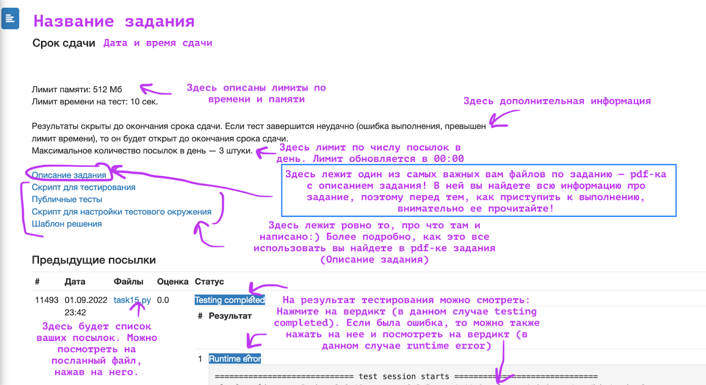
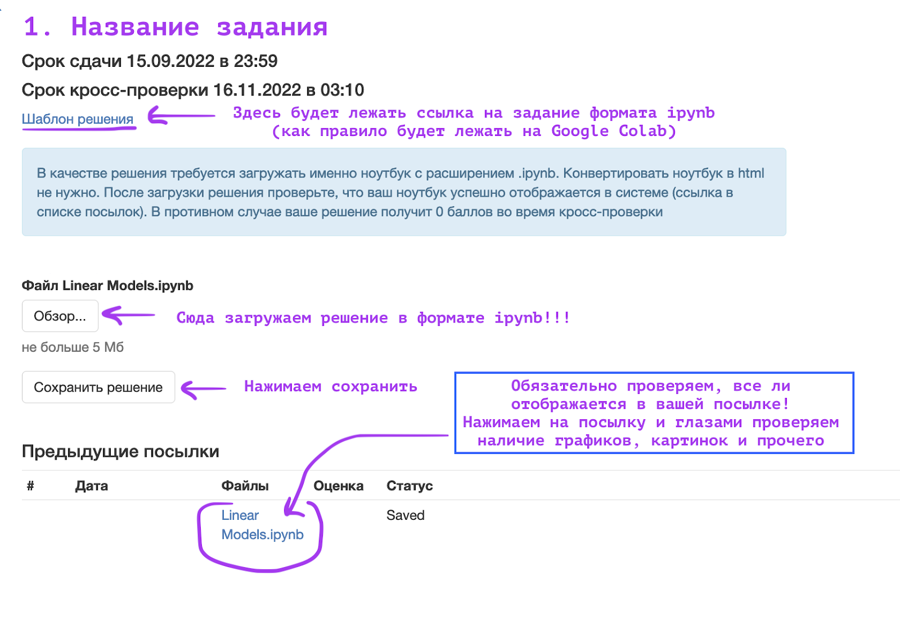
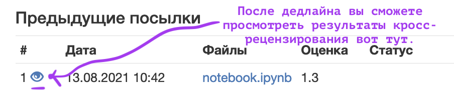

# Краткий туториал по работе в проверяющей системе

<!-- TOC -->

- [Краткий туториал по работе в проверяющей системе](#%D0%BA%D1%80%D0%B0%D1%82%D0%BA%D0%B8%D0%B9-%D1%82%D1%83%D1%82%D0%BE%D1%80%D0%B8%D0%B0%D0%BB-%D0%BF%D0%BE-%D1%80%D0%B0%D0%B1%D0%BE%D1%82%D0%B5-%D0%B2-%D0%BF%D1%80%D0%BE%D0%B2%D0%B5%D1%80%D1%8F%D1%8E%D1%89%D0%B5%D0%B9-%D1%81%D0%B8%D1%81%D1%82%D0%B5%D0%BC%D0%B5)
    - [Регистрация](#%D1%80%D0%B5%D0%B3%D0%B8%D1%81%D1%82%D1%80%D0%B0%D1%86%D0%B8%D1%8F)
    - [Типы заданий](#%D1%82%D0%B8%D0%BF%D1%8B-%D0%B7%D0%B0%D0%B4%D0%B0%D0%BD%D0%B8%D0%B9)
        - [Как сдавать задания с unit-тестированием и ML-задания](#%D0%BA%D0%B0%D0%BA-%D1%81%D0%B4%D0%B0%D0%B2%D0%B0%D1%82%D1%8C-%D0%B7%D0%B0%D0%B4%D0%B0%D0%BD%D0%B8%D1%8F-%D1%81-unit-%D1%82%D0%B5%D1%81%D1%82%D0%B8%D1%80%D0%BE%D0%B2%D0%B0%D0%BD%D0%B8%D0%B5%D0%BC-%D0%B8-ml-%D0%B7%D0%B0%D0%B4%D0%B0%D0%BD%D0%B8%D1%8F)
        - [Как сдавать задания с последующей кросс-проверкой](#%D0%BA%D0%B0%D0%BA-%D1%81%D0%B4%D0%B0%D0%B2%D0%B0%D1%82%D1%8C-%D0%B7%D0%B0%D0%B4%D0%B0%D0%BD%D0%B8%D1%8F-%D1%81-%D0%BF%D0%BE%D1%81%D0%BB%D0%B5%D0%B4%D1%83%D1%8E%D1%89%D0%B5%D0%B9-%D0%BA%D1%80%D0%BE%D1%81%D1%81-%D0%BF%D1%80%D0%BE%D0%B2%D0%B5%D1%80%D0%BA%D0%BE%D0%B9)
            - [Отправка своего решения](#%D0%BE%D1%82%D0%BF%D1%80%D0%B0%D0%B2%D0%BA%D0%B0-%D1%81%D0%B2%D0%BE%D0%B5%D0%B3%D0%BE-%D1%80%D0%B5%D1%88%D0%B5%D0%BD%D0%B8%D1%8F)
            - [Рецензирование](#%D1%80%D0%B5%D1%86%D0%B5%D0%BD%D0%B7%D0%B8%D1%80%D0%BE%D0%B2%D0%B0%D0%BD%D0%B8%D0%B5)
            - [Просмотр баллов за задание](#%D0%BF%D1%80%D0%BE%D1%81%D0%BC%D0%BE%D1%82%D1%80-%D0%B1%D0%B0%D0%BB%D0%BB%D0%BE%D0%B2-%D0%B7%D0%B0-%D0%B7%D0%B0%D0%B4%D0%B0%D0%BD%D0%B8%D0%B5)
    - [Сообщения об ошибках](#%D1%81%D0%BE%D0%BE%D0%B1%D1%89%D0%B5%D0%BD%D0%B8%D1%8F-%D0%BE%D0%B1-%D0%BE%D1%88%D0%B8%D0%B1%D0%BA%D0%B0%D1%85)

<!-- /TOC -->

## Регистрация

1. Первым делом зарегистрируйтесь в системе проверки, которую вам сообщил ментор курса
    * Вам понадобится ваша факультетская почта вида *@*.msu.ru. Зарегистрироваться можно будет только с нее. Рекомендуем использовать почту *@gse.cs.msu.ru.
    * Введите свои настоящие имя, фамилию и отчество (при наличии). Никнеймы и прочее --- не вводить, иначе мы не сможем вас идентифицировать и выставить вам оценку за курс

2. После регистрации введите инвайт на курс, который вам выдали в Telegram-канале курса

3. При регистрации на курс введите свою группу (три цифры). Если у вас группа вида 319/1, введите просто 319. Если вы студент другого факультета или у вас нет номера группы, укажите 999. Если в течение семестра ваша группа или ФИО изменились, то пишите в конце семестра в Telegram ментору курса, вручную вам поправим информацию на актуальную

## Типы заданий

Подробное описание типов заданий находится в [туториале по типам заданий](./tutorial_tasks.md).

### Как сдавать задания с unit-тестированием и ML-задания

### Как сдавать задания с последующей кросс-проверкой

#### Отправка своего решения
В качестве решения сдается выполненный ноутбук (notebook) в формате *.ipynb. В некотором роде это **отчет** о выполненном вами подзадании.

#### Рецензирование

Задания с кросс-проверкой подразумевают, что вы будете рецензировать работы других студентов. После дедлайна у вас будет еще 7 дней на то, чтобы **проверить решения как минимум трех других студентов**. **Без проверки других студентов вы не сможете получить баллы за свое задание**!

**Важно**: проверяйте, что все рецензии указаны в таблице. Если Вы добросовестно провели три рецензии, но задание не было засчитано, то пишите ментору курса в Telegram.

#### Просмотр баллов за задание

## Сообщения об ошибках
Если вы нашли в системе баг, заполняйте [форму сообщения об ошибках](https://docs.google.com/forms/d/e/1FAIpQLSdbBYbHeMD4gB-NCY_e-oxo99CfGGlbIMbFqnAet-FTjA8D9g/viewform). Если ошибка критическая и не позволяет продолжить работу в тестирующей системе, то сообщите о ней в беседе курса ММО или в личные сообщения ментору курса.
